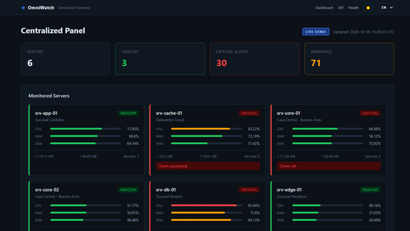
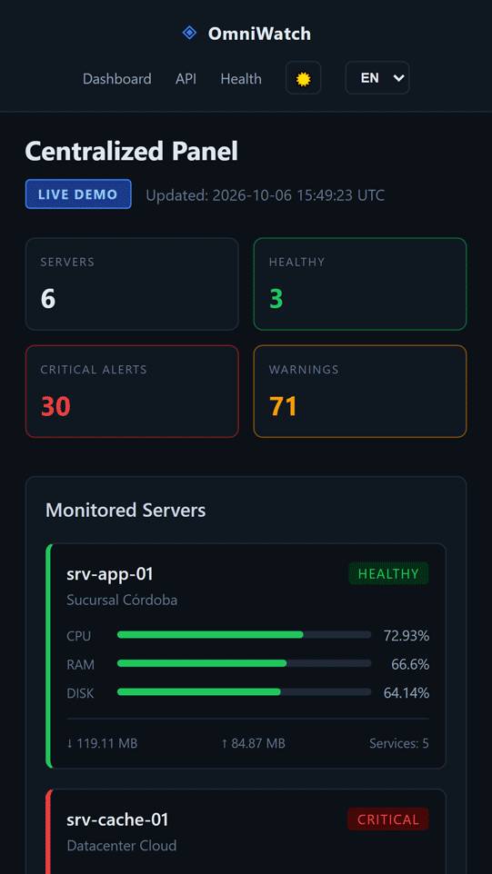

# OmniWatch

**OmniWatch** es una plataforma centralizada de telemetría, monitoreo proactivo y alertas multisede diseñada para empresas con sucursales distribuidas o infraestructura multi-servidor. Diseñado específicamente para consultores TI, administradores de sistemas y directores de operaciones en PyMEs, *OmniWatch* elimina el modelo de soporte reactivo y provee visibilidad total en tiempo real sobre recursos de cómputo, conectividad y disponibilidad de servicios.

Con agentes de recolección ligeros para hosts remotos, un panel de control interactivo para seguimiento visual inmediato y un motor de notificación multicanal (Telegram y Correo Electrónico), el proyecto detecta cuellos de botella e incidentes antes de que impacten en la facturación o atención al cliente, ofreciendo además un modo demo interactivo para demostraciones directas a clientes.

### 📸 Capturas de pantalla

<div align="center">
  <table border="0">
    <thead>
      <tr>
        <th align="center">Versión de PC</th>
        <th align="center">Versión Móvil</th>
      </tr>
    </thead>
    <tbody>
      <tr>
        <td align="center" valign="middle">
          
        </td>
        <td align="center" valign="middle">
          
        </td>
      </tr>
    </tbody>
  </table>
</div>

## ✨ Características Principales

* **Topología Multisede Unificada:** Agrupamiento de sucursales geográficamente dispersas con visualización de estado en vivo (En línea, Advertencia, Crítico).

* **Agente Colector Ultra-Ligero:** Script en Bash sin dependencias pesadas que extrae consumo de CPU, memoria, saturación de disco, latencia de red e integridad de servicios críticos (`systemd`), reportando vía API REST segura.

* **Alertas Automatizadas Inmediatas:** Despacho proactivo de notificaciones a grupos de Telegram o casillas de correo ante eventos como caída de servicios, desconexión de sedes o particiones al límite.

* **Modo Demo con Simulación Dinámica:** Capacidad de alternar entre métricas reales en producción y telemetría sintética en tiempo real para demostraciones públicas en portafolios web sin exponer nodos productivos.

* **Métricas Clave de Rendimiento:** Registro y representación de uso de memoria RAM, saturación de almacenamiento raíz, carga promedio de CPU e inspección de estado de servicios base (Web, Bases de Datos, ERPs).

* **Panel Web Responsive en Tiempo Real:** Interfaz construida en Python/Flask y JavaScript Vanilla con actualización asíncrona periódica sin recargar la página.

## ⚙️ ¿Qué Hace? (Módulos Disponibles)

Desde el monitoreo local de cada nodo hasta la centralización operativa, *OmniWatch* implementa los siguientes componentes:

1. **Servidor Central & API Hub (`app.py`):** Expone endpoints protegidos con token para ingesta de telemetría (`/api/report`), procesa umbrales de alerta y distribuye datos al panel administrativo.

2. **Agente de Recolección de Servidor (`agent/collector_agent.sh`):** Ejecuta tareas programadas en cada sede, consulta métricas del sistema operativo y transmite la información al Hub central.

3. **Panel Visual de Monitoreo (`templates/index.html`, `dashboard.js`):** Interfaz web responsive que refresca indicadores automáticamente cada 5 segundos mediante consumo de API asíncrono.

4. **Motor de Alertas:** Verifica umbrales críticos (>90% disco, >90% RAM o caída de nodos) y despacha mensajes formateados a canales de guardia técnica.

5. **Simulador de Telemetría:** Genera oscilaciones realistas de tráfico y recursos para despliegues de demostración en vivo.

## 🛠️ Tecnologías Utilizadas

* **Backend:** Python 3.10+ / Flask.

* **Frontend:** HTML5 semántico, CSS3 Vanilla con diseño industrial/dark mode y JavaScript asíncrono (Fetch API).

* **Agentes de Recolección:** Bash nativo (POSIX), GNU Coreutils, `curl`, `awk`.

* **Integraciones:** Bot API de Telegram, SMTP/Email.

* **Seguridad y Redes:** Autenticación por token Bearer en API REST y soporte de despliegue sobre VPN / HTTPS.

## 🚀 Instalación y Uso

1. Clonar el repositorio en el servidor central:
   ```bash
   git clone [https://github.com/yurialexanderpagelkruger/omniwatch-telemetry-hub.git](https://github.com/yurialexanderpagelkruger/omniwatch-telemetry-hub.git)
   cd omniwatch-telemetry-hub

## 👨‍💻 Autor

Desarrollado por **Yuri Alexander Pagel Krüger**
